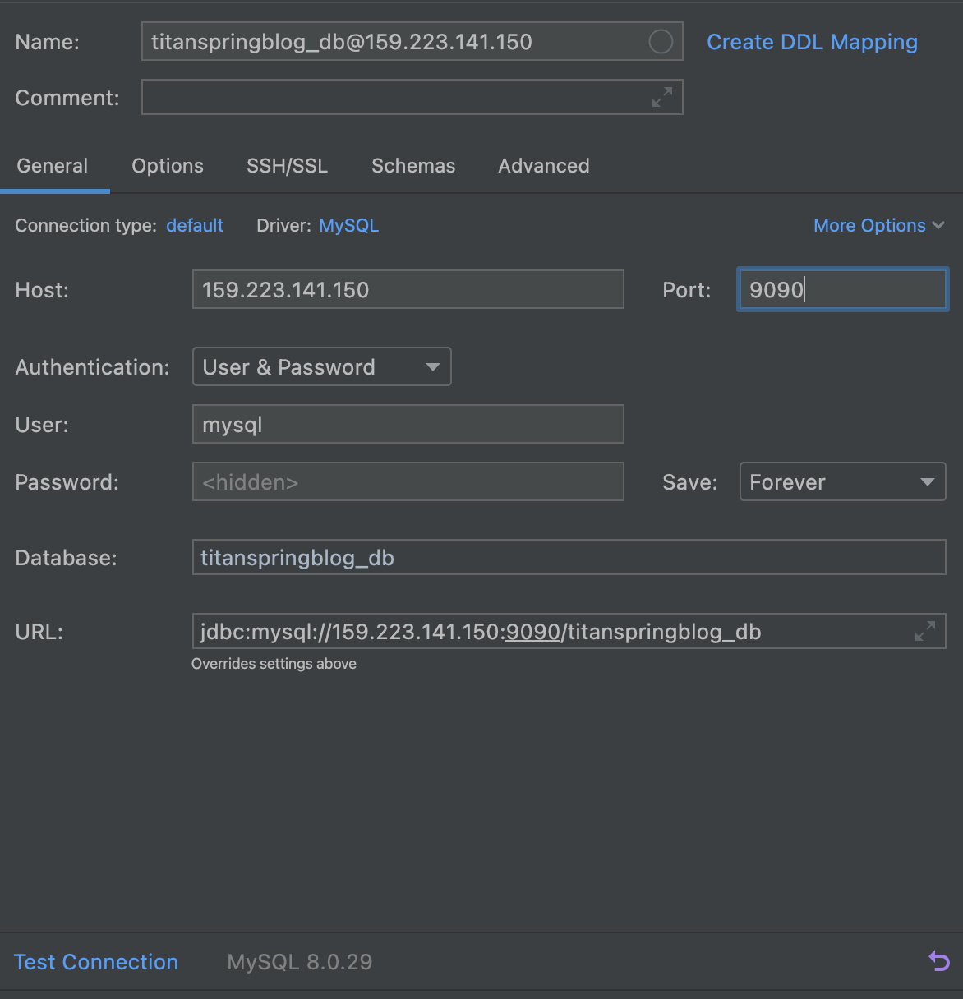

# Dokku Database Management


Running this script will return the 
values needed to connect to the database from any 
external utility such as IntelliJ.
```bash
bash <(curl -sS https://raw.githubusercontent.com/gocodeup/dokku-deployment-guide/java17/mysql.sh)
```

Once ran you would need to copy the values from the terminal into a new MySQL database connection. 
Example in intellij:




## Setting up MySQL with Dokku
From here, this guide is to help you with the basic database management from creating to a database to deleting it. This guide will currently only be covering for Dokku's mysql plugin.

### Installing MySQL plugin
To get us started when working with databases in Dokku we first have to install the mysql plugin. This is required when working with any external database in Dokku. To install the plugin you can ssh into your server and run the following command.
```bash
sudo dokku plugin:install https://github.com/dokku/dokku-mysql.git mysql
```
### Creating MySQL Database
To Create a database all we need to do is run a command from your server.
```bash
mysql:create <database_name>
```
Here is an example of how one could use the command above for your spring blog application.
```bash
dokku mysql:create spring_blog_db
```
#### Setting root password
If we want to use a custom root password for our mysql service we can use a specific flag `-r` to do so. Be warned that this will be **less secure** as the password will not have been randomly generated. On the command down below you will notice there is a `-r`, this is what we refer to as a flag.
```
mysql:create <database_name> -r <custom_root_password>
```
Here is an example of how you would create a spring blog db with a custom root password.
```bash
dokku mysql:create spring_blog_db -r customRootPassword
```
### Connecting Database to Application
When we want to connect *"or link"* our database to a specific application we have to run a command the following command from our server.
```bash
mysql:link <database_name> <app>
```
Here is an example of how one would link their database to their already existing dokku app.
```bash
dokku mysql:link spring_blog_db spring_blog_app
```
### Connecting To MySQL Prompt
To do queries in our dokku database we just need to run a command from the Server
```bash
mysql:connect <database_name>
```
Here is an example of how one would enter their database.
```bash
dokku mysql:connect spring_blog_db
```
##### MySQL : Connect Important Note
When you log-in to your mysql database using the command above you will only have read access and **will not** be able to create, edit, delete anything.
<br />
*This means we cannot create addition databases or manually insert data into our databases.*
<br />
To get around this we can log-in as our database's root user. To do, so you will first have to know the root password; to print your databases root password to the terminal just run the following command from the server.
```bash
cat /var/lib/dokku/services/mysql/<database_name>/ROOTPASSWORD
```
Here is an example of how we would run the command above with our spring blog database.
```bash
#Example

cat /var/lib/dokku/services/mysql/spring_blog_db/ROOTPASSWORD
```
#### Logging in as root user
Once we know what our root password is we can log into our database as root so that we can make changes to the database itself. To log-in as the root user first run the `mysql:connect` command. After you have entered the database, and you are prompted for a mysql query you can run the following command.
```bash
SYSTEM mysql -u root -p
```
After you run this command you will be prompted for a password this is where you will enter your root password. If all was done correctly you will now be able to make changes to your database. When you are finished making changes to your database you will have to exit twice, once to log out of the root user and once again to log out of the original database user. 
### Additional help
If there is something that is not covered in this guide I would recommend using the following command.
```
mysql:help
```
Here is an example below.
```bash
#Example

dokku mysql:help
```
If that does not help you can find the plugin's official documentation [here](https://github.com/dokku/dokku-mysql#readme)

### Home Menu
Click here to go to [menu](https://github.com/gocodeup/dokku-deployment-guide)
